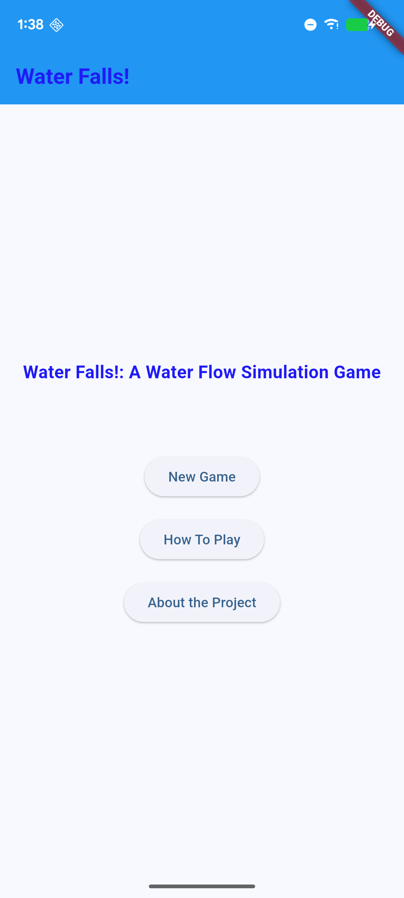
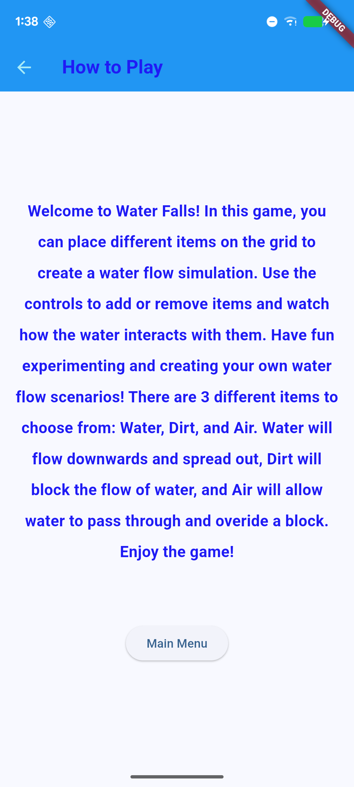
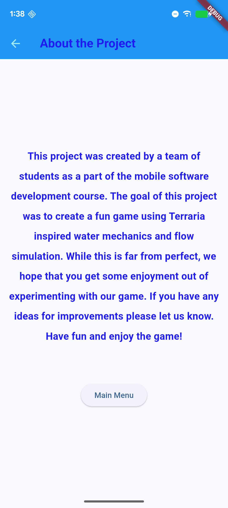
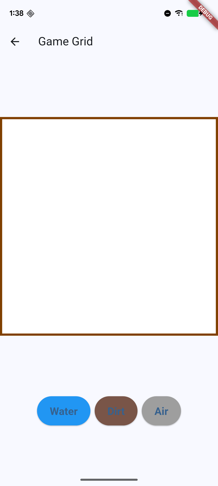
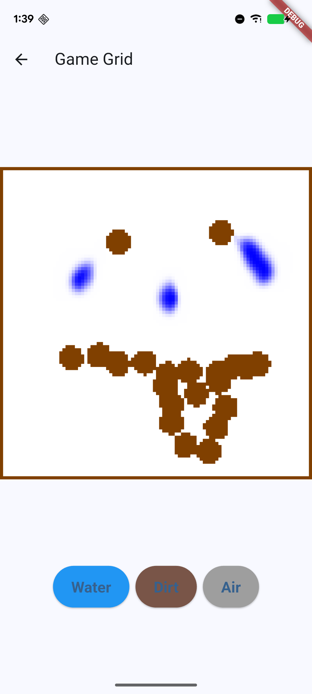
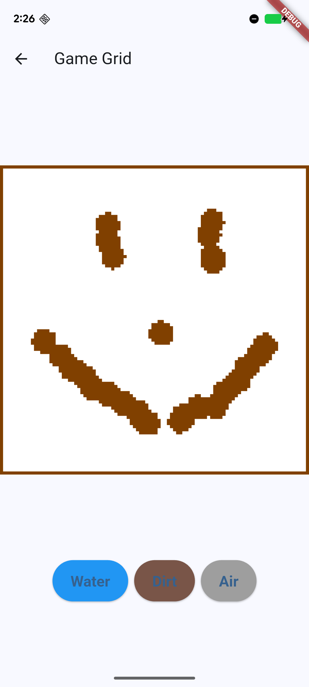
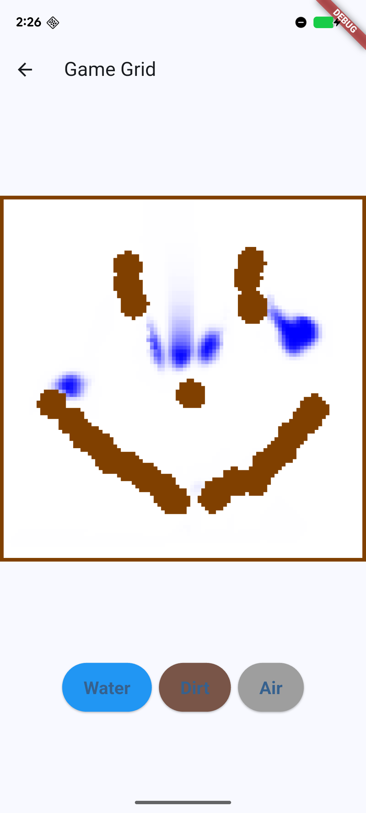

Water Falls is a simple fluid simulation app using the gravity sensor. The app is intended for light, casual fun and brief time wasting.

Water Falls is a simple fluid simulation app that can be used by anyone! You can draw with it, you can watch the water fall, you can use it to understand how to implement water physics, you can use it as a skeleton for your own liquid simulation physics app, the potential is limitless!!!!

Water Falls utilizes the built in gravity sensor in most phones, to achieve a simulation where the liquid actually simulates gravity. You can place a water block, which then follows which ever the sensor determines as down. After hitting the ground, or running into an obstacle, some or all of the water dissipates or gets reshaped by the environment. You can also place dirt blocks, which ignore gravity, and air blocks which acts as an eraser.

Water Falls is useful because of its applications. After working with water physics, we gained a better understanding of how difficult it is to utilize it. We had a lot of issues with implementing it within our code. With this rough draft of a water physics simulation app, it can be used as a starting point, or skeleton for more complex liquid simulations, like what we see in terraria. While it is not perfect, we have achieved a good foundational app that can be a launch pad for future implementations of liquid physics.

 
 
 
 
 
